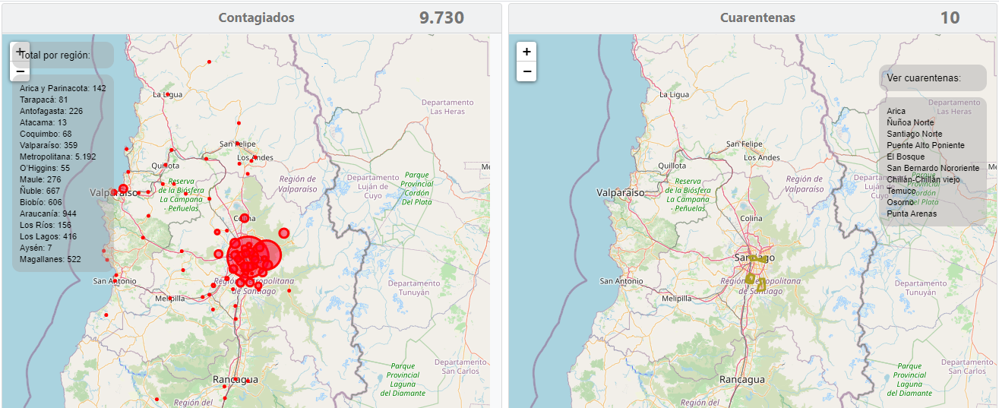

# MapCoVID19CL 
<p align="center">
    <a href="https://github.com/Juargo/mapCovid19CL/graphs/contributors" alt="Contributors">
        </a>
  
</p>
Mapa para presentar los datos entregados en la web de minsal con respecto a los casos de covid19 y las cuarentenas



## Tecnologías

### FrontEnd

https://leafletjs.com/ an open-source JavaScript library for mobile-friendly interactive maps

**Colaboración**: [JulioChile](https://github.com/juliochile)

### BackEnd

#### Get data contagiados
API para obtener data de web minsal desarrollada en Golang : http://167.99.156.156:8080/getDataMinsal

```​
Casosnuevos: 16
​​​​
Casostotales: 28
​​​​
Fallecidos: 0
​​​​
Name: "Arica y Parinacota"
```

#### Get data cuarentenas

API para obtener data de las cuarentenas desarrollada por: [JulioChile](https://github.com/juliochile/apicuarentenas)

url: http://167.99.156.156/apicuarentenas/infoMapa.php
